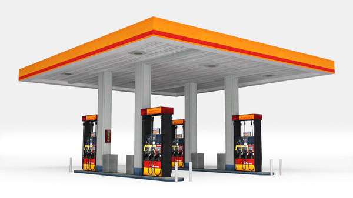

# sc-gasstation

An experimental service providing a way to exchange ERC20 tokens in ETH to pay for future transactions. 

# Installing

```
$ npm install -g testrpc
```

# running the component

In one terminal - start testRPC

```
$ testrpc -p 8546
```

go to the polymer client and run it


```
$ cd gs-client
$ bower install
$ polymer serve
```




## How does it work for a gastank ?

### Parameters

- min_reserve (in Wei)
- max_reserve (in Wei)
- savings_account (where received ETH goes)
- fee per fillup (margin spread)

### Setup

- create a lightwallet - or import PK
- fill in parameters ( see above )
- deposit ERC20 token to etherdelta
- give large allowance for ERC20 token to the etherdelta contract - to be able to trade a lot without having to give allowances over and over again.

### daemon process + express server

- Read etherdelta contract - find trade pairs for ETH
 - that have availableVolume > wei_per_fillup * max_reserve for ETH
- sort tradepairs by price - cheapest on top
- announce price + validity ( add fee ) 

- if reserve < min_reserve && availableVolume > (max_reserve - min_reserve) * wei_per_fillup
 - deposit ERC20 token to etherdelta
 - trade ERC20 token on etherdelta

### express server
- expose price
- endpoint that accepts transactions

